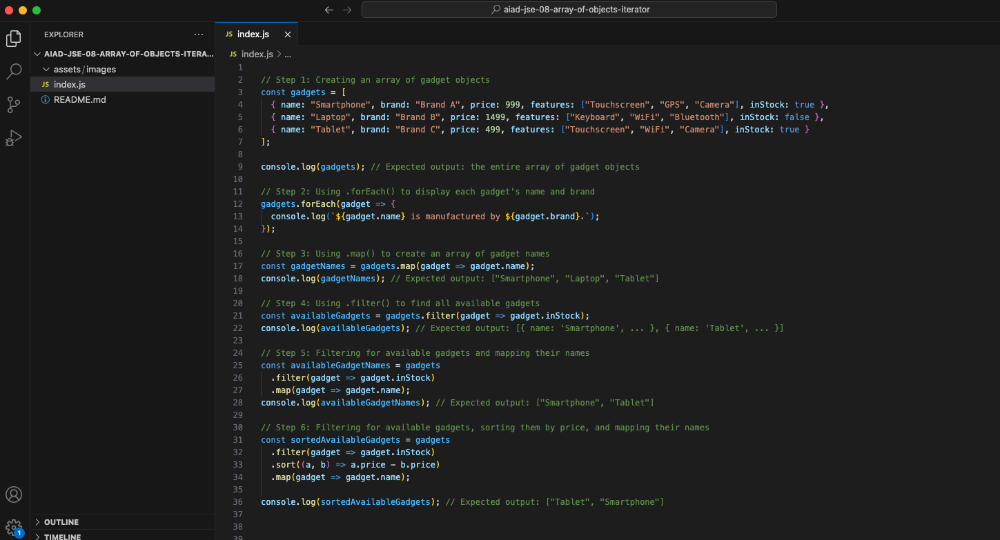

# JavaScript Basics: Mastering Iterators with Arrays of Objects



## Description 📄
In this project, you will practice working with array iterators in JavaScript. This hands-on activity will deepen your understanding of iterating through more complex data structures and using iterators to extract, transform, and log information efficiently.

## Expected Project Structure 🏗️
Your project will have the following structure:
```
PracticeArrayIterators/
└── index.js
```

# Instructions ✅

## 1. **Create the Project Folder and File**
Begin by setting up your project structure.

- [ ] Create a folder named `PracticeArrayIterators`.
- [ ] Inside the folder, create a file named `index.js`. This file will contain all your JavaScript code.

## 2. **Create an Array of Gadget Objects**
First, create an array to store objects representing different gadgets with their properties.

- [ ] Add the following code to your `index.js`:

```javascript
// Step 1: Creating an array of gadget objects
const gadgets = [
  { name: "Smartphone", brand: "Brand A", price: 999, features: ["Touchscreen", "GPS", "Camera"], inStock: true },
  { name: "Laptop", brand: "Brand B", price: 1499, features: ["Keyboard", "WiFi", "Bluetooth"], inStock: false },
  { name: "Tablet", brand: "Brand C", price: 499, features: ["Touchscreen", "WiFi", "Camera"], inStock: true }
];

console.log(gadgets); // Expected output: the entire array of gadget objects
```

- [ ] Run your JavaScript file in the terminal using `node index.js` to see the array of gadget objects printed.

**Expected Output:**
```
[ { name: 'Smartphone', ... }, { name: 'Laptop', ... }, { name: 'Tablet', ... } ]
```

**Explanation:**
- This code creates an array `gadgets` with each object representing a gadget, including properties such as `name`, `brand`, and `features`.

## 3. **Use .forEach() to Log Gadget Information**
Next, you will display the name and brand of each gadget using the `.forEach()` method.

- [ ] Add this code to your `index.js` file:

```javascript
// Step 2: Using .forEach() to display each gadget's name and brand
gadgets.forEach(gadget => {
  console.log(`${gadget.name} is manufactured by ${gadget.brand}.`);
});
```

- [ ] Run your JavaScript file again with `node index.js`.

**Expected Output:**
```
Smartphone is manufactured by Brand A.
Laptop is manufactured by Brand B.
Tablet is manufactured by Brand C.
```

**Explanation:**
- The `.forEach()` method loops over the `gadgets` array, logging each gadget's name and brand.

## 4. **Transform the Data Using .map()**
Now, you will transform the gadgets' names into a new array using the `.map()` method.

- [ ] Update your `index.js` with this code:

```javascript
// Step 3: Using .map() to create an array of gadget names
const gadgetNames = gadgets.map(gadget => gadget.name);
console.log(gadgetNames); // Expected output: ["Smartphone", "Laptop", "Tablet"]
```

- [ ] Run the file with `node index.js`.

**Expected Output:**
```
[ 'Smartphone', 'Laptop', 'Tablet' ]
```

**Explanation:**
- The `.map()` method creates a new array `gadgetNames` where each entry is the name of each gadget.

## 5. **Filter Gadgets by Availability Using .filter()**
You will now filter the `gadgets` array to display only those that are in stock.

- [ ] Add this code:

```javascript
// Step 4: Using .filter() to find all available gadgets
const availableGadgets = gadgets.filter(gadget => gadget.inStock);
console.log(availableGadgets); // Expected output: [{ name: 'Smartphone', ... }, { name: 'Tablet', ... }]
```

- [ ] Run your file with `node index.js`.

**Expected Output:**
```
[ { name: 'Smartphone', ... }, { name: 'Tablet', ... } ]
```

**Explanation:**
- The `.filter()` method returns a new array `availableGadgets` that contains only the objects where `inStock` is `true`.

## 6. **Combine Iterators and Sort**
Next, you will filter available gadgets, map their names, and then sort them by price in ascending order.

- [ ] Add the following code:

```javascript
// Step 6: Filtering for available gadgets, mapping their names, and sorting them by price
const sortedAvailableGadgets = gadgets
  .filter(gadget => gadget.inStock)
  .sort((a, b) => a.price - b.price)
  .map(gadget => gadget.name);

console.log(sortedAvailableGadgets); // Expected output: ["Tablet", "Smartphone"]
```

- [ ] Run your JavaScript file to see the output.

**Expected Output:**
```
[ 'Tablet', 'Smartphone' ]
```

**Explanation:**
- First, `.filter()` selects available gadgets, then `.sort()` arranges them by price in ascending order, and finally, `.map()` creates an array of their names.

## 7. **Test Your Knowledge**
Try creating a new array with different criteria, such as filtering based on features or sorting by other properties, and practice chaining iterator methods.

## 8. **Commit and Push to GitHub**
Make sure you commit your changes and push them to GitHub.

# Conclusion 📄
In this project, you practiced how using `.forEach()`, `.map()`, `.filter()`, and `.sort()` with arrays of objects. These iterator methods allow you to log, transform, filter, and sort complex data structures, which are essential skills for working with arrays in real-world applications.

---


### Solution Codebase 👀
🛑 **Only use this as a reference** 🛑

💾 **Not something to copy and paste** 💾

**Note:** This lab references a solution file located [here](https://github.com/HackerUSA-CE/aiad-jse-08-array-of-objects-iterator/tree/solution) (link not shown).


© All rights reserved to ThriveDX
